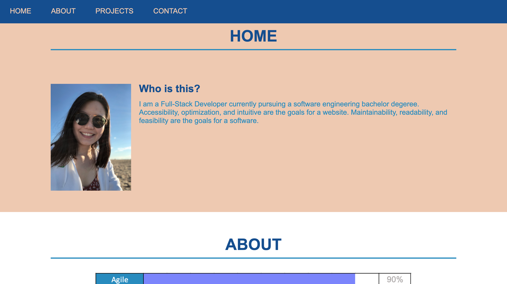

# Portfolio

## INFORMATION:

1. [assets] folder contains the [images] folder and the [screenshots] folder.
2. [images] folder contains the images for the index.html.
3. [screenshots] folder contains the screenshots of the refactored code and the sceenshots of the website for submission.

## Purpose:

A deployed portfolio for furture sucess.

## Built With

- HTML
- CSS

## Website

https://ting-hu.github.io/Portfolio/

## Contribution

Refactored by Xueting Hu

## Screenshots

